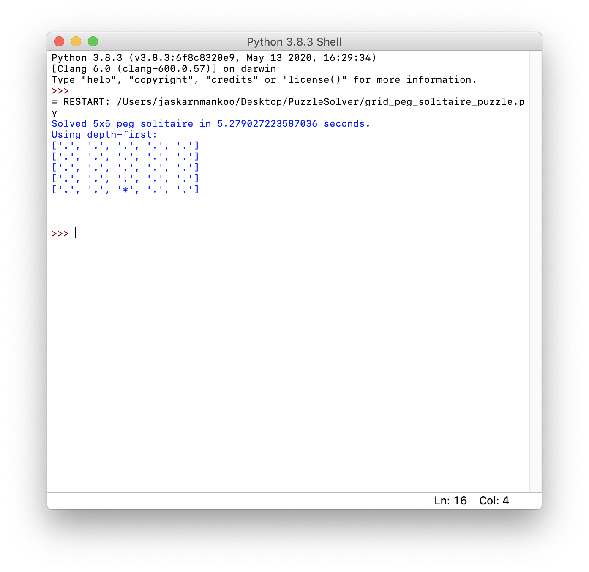
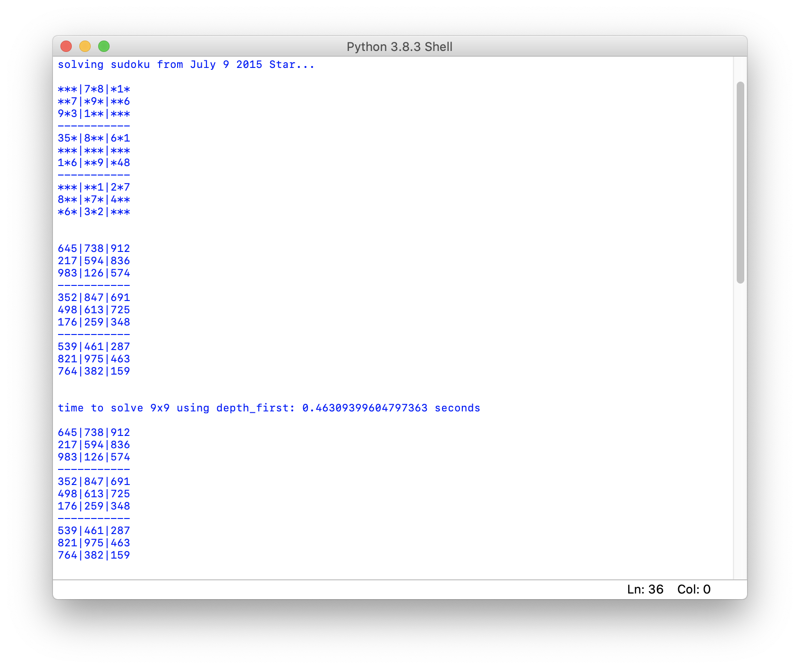
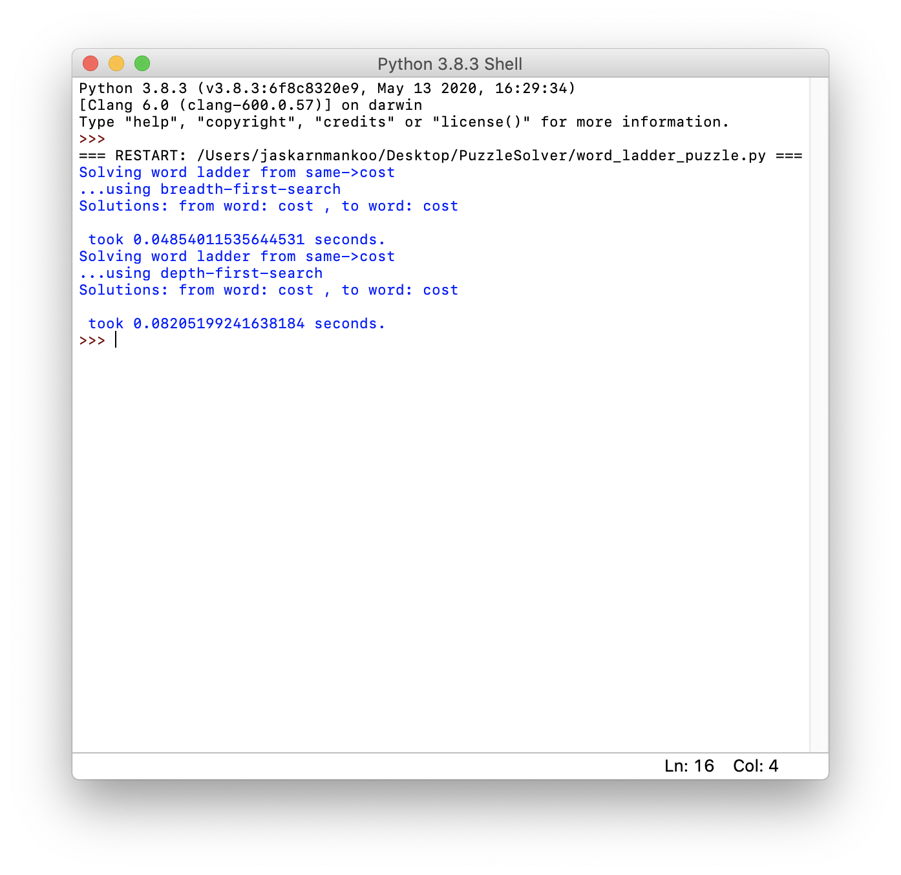

# CSC148: Introduction to Computer Science

This repository contains a project from CSC148: Introduction to Computer Science course taken at University of Toronto Mississauga.

## PuzzleSolver

A project done in pairs that uses Breadth-First Search (BFS) and Depth-First Search (DFS) to solve various puzzles.

* [Grid Peg Solitaire](#execution-of-grid-peg-solitaire-solver)
* [Sudoku](#execution-of-sudoku-solver)
* [Word Ladder](#execution-of-word-ladder-solver)

### Execution of Grid Peg Solitaire Solver

### Execution of Sudoku Solver

### Execution of Word Ladder Solver

